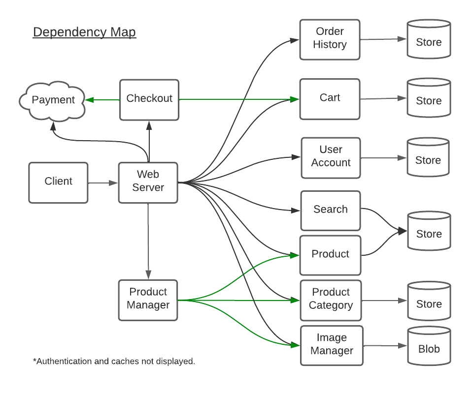
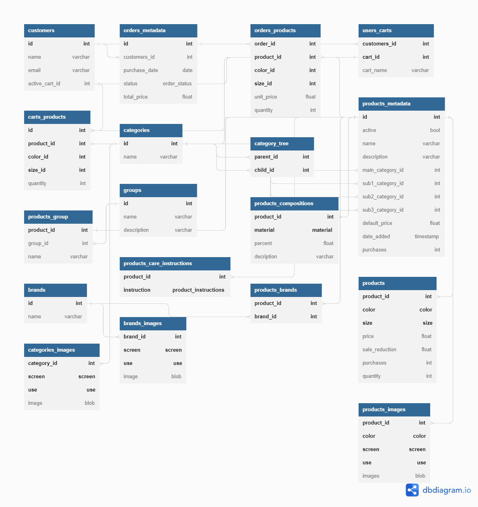

# Online Store
 An online store project

## Requirements

### Functional requirements
- Users can:
    - login, logout, sign up
    - view products by category
    - Search products by inputed string
    - Sort by price, date added, and popularity
    - Filter by size, material, brand, and color
    - Further filter searched products by category
    - View, add, delete and update in quantity products in their cart
    - Create, change to and edit name of a cart and merge carts (Users can have multiple carts!)
    - Purchase items in a cart
    - View past orders
- Admins can additionally:
    - Create, update and delete products
    - Create, update and delete categories

### Non-functional requirements
- **Available:** Website is highly available.
- **Scalable:** Website scales gracefully with increased users.
- **Consistent:** products in the user's cart reflects the products that the user added to their cart.
- **Secure:** payment system is secure.

## App design

### Use Cases
- User starts by visiting the Home page and can
    - visit the Login or Signup page
        - in the Login or Signup page, users can
            - login or signup and on success be redirected back to the Home page
    - logout if logged in
    - search products using a search box
        - When search is entered, user is directed to the Products page and can
            - view products' summaries matching the search string
                - clicking a product takes the user to the Product page where they can
                    - view the product in greater detail
                    - add the product to their cart
                - sort products by date added, price, and popularity
                - filter products by brand, color, size and material
    - view all products' categories
        - clicking a category takes the user to the Products page filtered by the clicked category
    - view popular products' summaries
        - clicking a popular product takes the user to the Product page
    - view the quantity of products in their cart. clicking the cart will take user to the Cart page where they can
        - lower in quantity or remove a product from their cart
        - view sum of all products' prices in their cart
        - switch to a different cart
        - edit their current cart's name
        - merge carts
        - go to the Checkout page where they can securely purchase all products in their cart
            - On successful purchase user is directed to the Order History page with a visual notification of a successful payment
    - visit the Order History page and view summaries of their past orders.
- Anonymous users have all the abilities of a Logged in user except viewing their order history and creating multiple carts
    - When an Anonymous user logs in with a non-empty cart the items are added to a newly created cart which becomes the active cart.
- An admin, after logging into the Admin login page, can search, view, add, edit and delete products and products' categories.

### Database schema

*Above is a sql-like view of the table. The markup language can be found at [database's markup language](./dbschema/db_markup_short.txt). A document model can be found at [databases document model](./dbschema/document_database_model.js)

## Web pages
#### Home
#### Login
#### Sign up
#### Products
#### Product
#### Cart
#### Checkout
#### Order History
#### Admin Dashboard
#### Admin Login
#### Admin Products
#### Admin Categories

## Tech stack
### Material Ui
### React
### React-Router
### React Icons
### Firestore (document storage by firebase)
### Fire Storage (blob storage by firebase)
### Stripe
### Algolia

## Extra APIs
- background functions used

