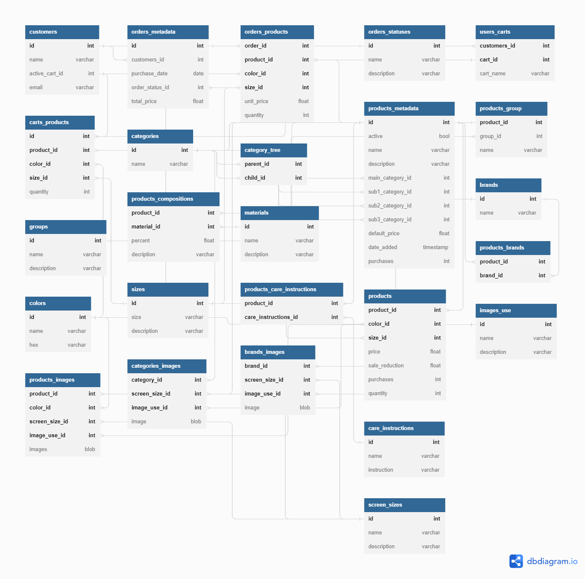

# Online Store
 An online store project

## Requirements

### Functional requirements
- **Login, signup and logout:** Users can create, login and logout of their account.
- **View, add, edit and delete products:** Users can view products and admins can add, edit and delete products.
- **View, add, edit and delete products' categories :** Users can view products and admins can add, edit and delete products' categories.
- **Search products:** Users can search products based on a string key.
- **View, add, update quantity and delete products in cart:** Users can view, add and delete products in their cart
- **Purchase items in cart:** Users can securely purchase items in their cart.
- **View past orders:** Users can view summaries of their past orders.

### Non-functional requirements
- **Available:** Website is highly available.
- **Scalable:** Website scales gracefully with increased users.
- **Consistent:** products in the user's cart reflects the products that the user added to their cart.
- **Secure:** payment system is secure.

## App design

### Use Cases
- Users start by visiting the Home page and can
    - visit the Login or Signup page
        - in the Login or Signup page, users can
            - login or signup and on success be redirected back to the Home page
                - if the user's cart is non-empty it'll be merged with their account's cart
    - logout if logged in
    - search products using a search box
        - When search is entered, user is directed to the Products page and can
            - view products' summaries matching the search string
                - clicking a product takes the user to the Product page where they can
                    - view the product in greater detail
                    - add the product to their cart
    - view all products' categories
        - clicking a category takes the user to the Products page filtered by the clicked category
            - clicking a product takes the user to the Product page where they can
                - view the product in greater detail
                - add the product to their cart
    - view popular products' summaries
        - clicking a popular product takes the user to the Product page where they can
            - view the product in greater detail
            - add the product to their cart
    - view the quantity of products in their cart
    - Users can navigate to the Cart page and can
        - lower in quantity or remove a product from their cart
        - view sum of all products' prices in their cart
        - go to the Checkout page where they can securely purchase all products in their cart
            - On successful purchase user is directed to the Successful Purchase page
    - visit the Order History page and view summaries of their past orders.
- An admin, after logging into the Admin login page, can search, view, add, edit and delete products and products' categories.
- Users can anonymously
    - search products by search string
    - search products by products' categories.
    - add products to their cart
    - change in quantity or remove products in their cart
    - securely purchase products in their cart

### Services' descriptions
##### Web Server
Serves static web pages that the user uses to interface with other services.
##### Authentication
Handles login, logout and sign up of the user. Only when the user is logged in, can he or she view their order history, cart and user info. Additionally, a user logged with an admin account can view, add, update and delete products and product categories. After the user signs up, the service stores the user's info using the User Account service and automatically logs the user in.

##### Users' accounts
Gets, updates and adds user's info in a database. Ensures users can only get and update their own info and only a sign up event adds a new entry to the database.
##### Products
Anyone can retrieve a products info. Used to get, update and create new products. Only an admin account can update and create new products.
##### Products' categories
similar to  the Products service
##### Images' manager
similar to  the Products service
##### Products' manager
Only admin accounts can access this service. This service is used to create a product and/or product category with its associated images and stores them using the appropriate service. This service links the product and/or product categories with the images they were created with stored in the blob store. Additionally, Admins can view, update and delete products and products' categories and their associated images.
##### Search
Anyone can use this service. Used to search products given a query string or filter. When searching by query string, products with tags or parts of their title or description matching the query string are returned. When searching by filter, products with a tag matching the filter are returned.
##### Carts
Users can only modify their cart. Used to get, add, update, and delete products in their cart.
##### Orders' histories
Gets, and adds summaries of users' purchases. Users restricted to get and add their own purchase summaries.
##### Checkout
Helps users securely make a purchase. User does not interact with this service directly.

### Database schema

*Above is a sql-like view of each table. The database used for each table will depend on the tables requirement. An example: The image table will be implemented as a blob store with each unique tag name or product id being a container containing the images created with it using the Product Manager service.

## Api design of services

### Web server

### Authentication

##### login(email : string, password : string) : Promise
**Description**
Logs users into their account. On success, behind the scenes an authentication object is recieved and passed during other api calls. 

**Parameters**
email - unique email bound to user's account
password - password associated to user's account
 

**Returns**
a promise object that on success the user is considered logged in and on failure passes one of the exceptions below as a string.
 

**Exceptions**
EMAIL_DNE - The email does not exist.
WRONG_PASSWORD - The password is incorrect.
SERVER_ERROR - The Api call failed because the server did not respond.

##### logout() : Promise
##### is_logged_in : bool

### Users' accounts
### Products' categories
### Products
### Images' manager
### Search
### Carts
### Checkouts
### Orders' histories
### Products' manager

## Implementation
### Web pages
##### Home
##### Login
##### Sign up
##### Products
##### Product
##### Cart
##### Checkout
##### Successful Purchase
##### Order History
##### Admin's Dashboard
##### Admin's Login
##### Admin's Products
##### Admin's Products' Categories

### Technolgies used
##### React
##### React-Router
##### React Icons
##### Firebase

